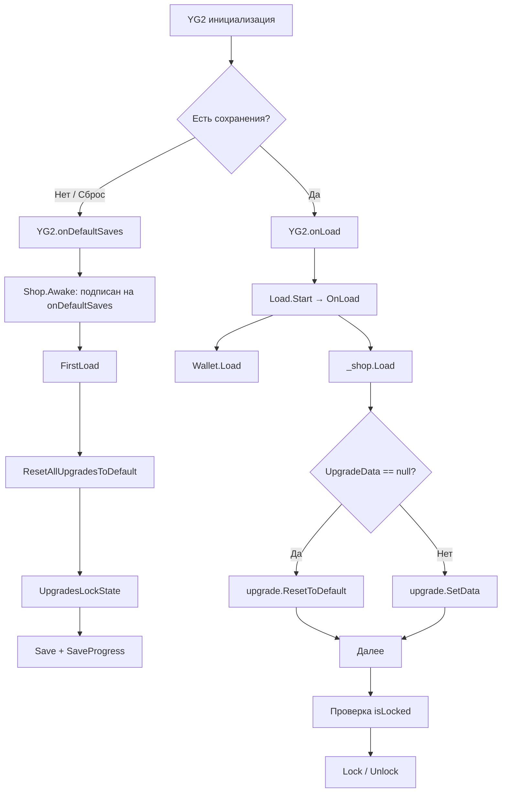

# План: Исправление FirstLoad после сброса прогресса

## Анализ проблемы

### Текущая архитектура загрузки

После сброса прогресса (через `YG2.SetDefaultSaves()`) поток выполнения выглядит так:

```
YG2 инициализация
  │
  ├── Load.Awake()          — закомментирован SetDefaultSaves()
  ├── Shop.Start()          — подписывается на YG2.onDefaultSaves += FirstLoad
  │                           и подписывает upgrade.SellButtonClick
  ├── Load.Start()          — вызывает OnLoad()
  │     └── _shop.Load()   — для каждого апгрейда вызывает ApplyUpgradeData()
  │                           └── если data == null → Save() + return (без SetData!)
  │
  └── YG2.onDefaultSaves    — когда срабатывает?
        └── FirstLoad()     — UpgradesLockState() + Save() + SaveProgress()
```

### Коренные причины

1. **Неопределённый порядок Start() в Unity**: `Load.Start()` и `Shop.Start()` могут вызываться в любом порядке. Если `Load.Start()` выполняется раньше, то `_shop.Load()` обрабатывает апгрейды ДО того, как `Shop.Start()` подписал `SellButtonClick`.

2. **FirstLoad не защищает от повторного вызова**: Если `onDefaultSaves` срабатывает ДО `Shop.Start()`, то `FirstLoad()` не подписан и не выполняется. Если срабатывает ПОСЛЕ — делает лишнюю работу.

3. **ApplyUpgradeData не восстанавливает базовые значения при null данных**: Когда `data == null`, код вызывает `Save()` (сохраняет текущие `Awake`-значения) и возвращается, НО не вызывает `SetData()`. Условно корректно для первого запуска, но не восстанавливает значения после реального сброса.

4. **Save() перезаписывает все данные для всех апгрейдов**: Если хотя бы один `data == null`, `Save()` вызывается и перезаписывает все поля `SavesYG.passiveUpgradeX`, даже если некоторые уже были валидно загружены ранее в той же итерации `Load()`.

### Рекомендуемое исправление

## Изменение 1: Shop.cs — Исправить ApplyUpgradeData()

Вместо вызова `Save()` при `data == null`, нужно вызывать `ResetToDefault()` — метод, который сбрасывает апгрейд к его базовым значениям из инспектора.

```csharp
private void ApplyUpgradeData(Upgrade upgrade, UpgradeData data)
{
    if (data == null)
    {
        upgrade.ResetToDefault();  // Новый метод — сбрасывает к basePrice/baseProfit
        return;
    }

    upgrade.SetData(data);

    if (data.isLocked)
        upgrade.Lock();
    else
        upgrade.Unlock();
}
```

## Изменение 2: Upgrade.cs — Добавить ResetToDefault()

Добавить метод, который сбрасывает апгрейд к базовым значениям.

```csharp
public void ResetToDefault()
{
    _currentPrice = _basePrice;
    _currentProfit = _baseProfit;
    _isLocked = true;        // По умолчанию заблокирован (кроме первого)

    UpdateUI();
}
```

## Изменение 3: Upgrade.cs — Убрать сброс из Awake()

`Awake()` не должен самовольно сбрасывать значения, так как `SetData()` может вызываться до/после `Awake()`.

Перенести логику инициализации в `Awake()` НО с проверкой — если `_currentPrice` уже было установлено через `SetData()`, не сбрасывать.

Или ещё проще: `Awake()` оставить как есть для гарантии, что у апгрейда есть начальные значения. А `ResetToDefault()` будет использоваться ТОЛЬКО при сбросе прогресса.

```csharp
private void Awake()
{
    // Базовая инициализация на случай, если ничего не загружено
    _currentPrice = _basePrice;
    _currentProfit = _baseProfit;
    UpdateUI();
}
```

## Изменение 4: Shop.cs — FirstLoad должен вызывать ResetToDefault()

В `FirstLoad()` нужно явно сбросить все апгрейды к базе перед сохранением.

```csharp
private void FirstLoad()
{
    ResetAllUpgradesToDefault();  // Новый метод

    UpgradesLockState(_passiveUpgrades);
    UpgradesLockState(_tapUpgrades);

    Save();
    YG2.SaveProgress();
}

private void ResetAllUpgradesToDefault()
{
    foreach (var upgrade in _passiveUpgrades)
        upgrade.ResetToDefault();

    foreach (var upgrade in _tapUpgrades)
        upgrade.ResetToDefault();
}
```

## Изменение 5: Shop.cs — Гарантировать порядок вызовов

Перенести подписку `YG2.onDefaultSaves` из `Start()` в `Awake()`, чтобы `FirstLoad()` точно подхватил событие, даже если `Load.Start()` вызывается раньше `Shop.Start()`.

```csharp
private void Awake()
{
    YG2.onDefaultSaves += FirstLoad;
}
```

И отписаться в `OnDestroy()`.

## Диаграмма потока (исправленная)



## Сводка изменений

| Файл | Изменение |
|------|-----------|
| `Assets/Scripts/Shop/Shop.cs` | 1. Перенести `YG2.onDefaultSaves += FirstLoad` в `Awake()` (строка 22)<br>2. В `ApplyUpgradeData()` при `data == null` вызывать `upgrade.ResetToDefault()` вместо `Save()`<br>3. Добавить `ResetAllUpgradesToDefault()`<br>4. Вызывать `ResetAllUpgradesToDefault()` в начале `FirstLoad()` |
| `Assets/Scripts/Shop/Upgrade.cs` | 1. Добавить метод `ResetToDefault()`<br>2. `Awake()` оставить без изменений — базовая инициализация |