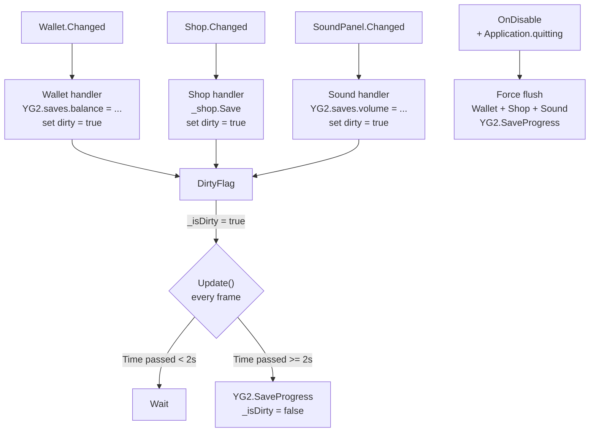

# План: Оптимизация сохранений (Fix Save Spam)

## Проблема

В текущей реализации [`SaveProgress`](Assets/Scripts/DataSave/Save.cs) вызывается `YG2.SaveProgress()` при каждом изменении данных:

### Цепочка вызовов при клике:
1. [`Wallet.AddMoney()`](Assets/Scripts/Wallet/Wallet.cs:29) → `Changed?.Invoke()`
2. → [`SaveProgress.Wallet()`](Assets/Scripts/DataSave/Save.cs:33) → `YG2.SaveProgress()` — **блокирующая запись**

### Цепочка вызовов при покупке апгрейда (3 сохранения за одну покупку!):
1. [`Wallet.Deduct()`](Assets/Scripts/Wallet/Wallet.cs:66) → `Changed` → `SaveProgress.Wallet()` → `YG2.SaveProgress()`
2. [`Shop.TrySellUpgrade()`](Assets/Scripts/Shop/Shop.cs:176) → `YG2.SaveProgress()` 
3. `Changed?.Invoke()` (строка 178) → `SaveProgress.Shop()` → `YG2.SaveProgress()`

**Итог:** при быстром клике/тапе `YG2.SaveProgress()` вызывается десятки раз в секунду, вызывая подвисания.

## Решение: Throttle-сохранения (1 раз в 2 секунды)

Изменяем только существующий файл [`Save.cs`](Assets/Scripts/DataSave/Save.cs). Никаких новых файлов.

### Что меняется

#### 1. [`Save.cs`](Assets/Scripts/DataSave/Save.cs) — добавляем throttle:



**Логика:**
- Данные в `YG2.saves` (память) пишутся **мгновенно при каждом событии**
- Вызов `YG2.SaveProgress()` (запись на диск/облако) — **не чаще 1 раза в 2 секунды** через `Update()`
- При `OnDisable()` / закрытии игры — **немедленное сохранение** всех накопленных данных
- Интервал сохранения — `[SerializeField] private float _saveInterval = 2f`

#### 2. [`Shop.TrySellUpgrade()`](Assets/Scripts/Shop/Shop.cs:175-176) — убираем прямой вызов:

```diff
 Save();
-YG2.SaveProgress();
 Changed?.Invoke();
```

`Shop.Save()` остаётся — он просто пишет данные в `YG2.saves` (память). Сохранением на диск управляет `SaveProgress`.

### Сравнение «было → стало» для [`Save.cs`](Assets/Scripts/DataSave/Save.cs)

**Было (спам):**
```csharp
private void Wallet()
{
    YG2.saves.balance = _wallet.Balance;
    YG2.saves.clickPerSecond = _wallet.ClickPerSecond;
    YG2.saves.tapPower = _wallet.TapPower;
    YG2.SaveProgress(); // ← блокирующий вызов при КАЖДОМ изменении
}
```

**Стало (throttle):**
```csharp
private void Wallet()
{
    YG2.saves.balance = _wallet.Balance;
    YG2.saves.clickPerSecond = _wallet.ClickPerSecond;
    YG2.saves.tapPower = _wallet.TapPower;
    _isDirty = true; // ← просто флаг, данные уже в памяти
}
```

А `YG2.SaveProgress()` теперь вызывается из `Update()` не чаще 1 раза в 2 секунды, и форсированно в `OnDisable()`.

### Почему данные не потеряются

- `YG2.saves` — это **объект в оперативной памяти**. Запись туда происходит мгновенно
- `YG2.SaveProgress()` — это **сериализация + запись на диск / в облако**. Вот это мы throttle'им
- При закрытии сцены/игры вызывается `OnDisable()` → форсированный `YG2.SaveProgress()`

## Шаги реализации (только 2 файла)

1. **[Save.cs](Assets/Scripts/DataSave/Save.cs)** — добавить throttle-логику:
   - Добавить поля: `_isDirty`, `_lastSaveTime`, `_saveInterval`
   - Добавить метод `Update()` c проверкой dirty-флага и интервала
   - Убрать `YG2.SaveProgress()` из `Wallet()`, `Shop()`, `Sound()` — заменить на `_isDirty = true`
   - В `OnDisable()` — оставить форсированный `YG2.SaveProgress()`

2. **[Shop.cs](Assets/Scripts/Shop/Shop.cs:176)** — убрать строку:
   - Удалить `YG2.SaveProgress();` из `TrySellUpgrade()`