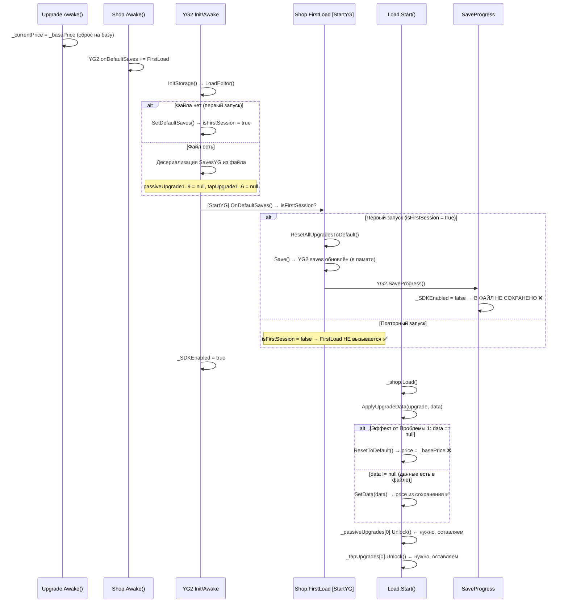

# План: Исправление загрузки данных Upgrade после перезапуска

## Проблема

После перезапуска игры данные апгрейдов (цена, профит) сбрасываются к стартовым значениям.

## Корневая причина

### 🔴 Проблема 1: `FirstLoad()` вызывает `SaveProgress()` когда `_SDKEnabled == false` — **ГЛАВНАЯ**

В [`Shop.cs:28-36`](../Assets/Scripts/Shop/Shop.cs:28): `FirstLoad()` вызывается через `onDefaultSaves` (коллбэк `[StartYG]`):
1. `ResetAllUpgradesToDefault()` — ✅ правильно
2. `UpgradesLockState()` — ✅ правильно
3. `Save()` — сохраняет дефолтные данные в `YG2.saves` (в памяти) ✅
4. `YG2.SaveProgress()` — пытается записать в файл, НО...

В [`Storage_yg.cs:71`](../Assets/PluginYourGames/Modules/Storage/Scripts/Storage_yg.cs:71): `SaveProgress()` проверяет `_SDKEnabled` и **возвращается без сохранения**, если флаг `false`.

Флаг `_SDKEnabled` устанавливается в `true` [ПОСЛЕ вызова всех `[StartYG]` методов](`../Assets/PluginYourGames/Scripts/Basic/YG2.cs:92`):
```csharp
CallAction.CallIByAttribute(typeof(StartYGAttribute), typeof(YG2));
_SDKEnabled = true; // <- только ПОСЛЕ вызова onDefaultSaves и FirstLoad
```

**Итог:** дефолтные данные апгрейдов НИКОГДА не записываются в файл при первом запуске.

### 🔴 Проблема 2: `Upgrade.Awake()` переписывает цену

В [`Upgrade.cs:36-42`](../Assets/Scripts/Shop/Upgrade.cs:36) `Awake()` устанавливает `_currentPrice = _basePrice`. Если бы данные загружались нормально, `SetData()` в `Shop.Load()` всё равно перезаписал бы их. Но в сочетании с Проблемой 1 — данных нет, цена остаётся базовой.

### 🔴 Проблема 3: Сценарий на втором запуске

1. Файл сохранения существует, в нём `balance`, `tapPower` и другие поля есть (они сохраняются нормально), но `passiveUpgrade1` = `null` (не были сохранены из-за Проблемы 1)
2. `YG2.InitStorage()` → `LoadEditor()` → десериализует файл — `passiveUpgrade1` = `null`
3. `YG2.LoadProgress()` → `YG2.saves.idSave > 0` → вызывается `GetDataInvoke()` (данные готовы)
4. `Load.Start()` → `_shop.Load()` → `ApplyUpgradeData(upgrade, null)` → `upgrade.ResetToDefault()` → **цена = базовая** 😱

### Диаграмма потока вызовов



## План исправлений

### [Шаг 1] [`Assets/Scripts/Shop/Upgrade.cs`](../Assets/Scripts/Shop/Upgrade.cs) — убрать сброс цены из `Awake()`

```csharp
// Было:
private void Awake()
{
    _currentPrice = _basePrice;
    _currentProfit = _baseProfit;
    UpdateUI();
}

// Стало:
private void Awake()
{
    UpdateUI();
}
```

**Почему:** `_currentPrice` и `_currentProfit` — это `double` поля класса, их начальное значение = 0. Это нормально, потому что:
- `ResetToDefault()` или `SetData()` будут вызваны до первого взаимодействия пользователя
- `UpdateUI()` показывает начальное состояние (текст может быть пустым 0, но это мелькание до загрузки данных)

**ВАЖНО:** Если текстовое поле будет показывать "0" между `Awake()` и `Shop.Load()`, нужно также доработать `ResetToDefault()` вызывать при старте, если данные не загрузились. Альтернатива — инициализировать поля сразу при объявлении:

```csharp
private double _currentPrice = 0; // или _basePrice как дефолт
```

Лучший вариант: оставить инициализацию в `Awake()` через `ResetToDefault()` вместо прямого присвоения. Так код будет чище.

**Итоговое решение:** вызывать `ResetToDefault()` в `Awake()`:
```csharp
private void Awake()
{
    ResetToDefault(); // устанавливает _currentPrice из _basePrice
}
```

### [Шаг 2] [`Assets/Scripts/Shop/Shop.cs`](../Assets/Scripts/Shop/Shop.cs) — убрать `Save()` и `YG2.SaveProgress()` из `FirstLoad()`

**Было:**
```csharp
private void FirstLoad()
{
    ResetAllUpgradesToDefault();
    UpgradesLockState(_passiveUpgrades);
    UpgradesLockState(_tapUpgrades);

    Save();
    YG2.SaveProgress();
}
```

**Стало:**
```csharp
private void FirstLoad()
{
    ResetAllUpgradesToDefault();
    UpgradesLockState(_passiveUpgrades);
    UpgradesLockState(_tapUpgrades);
}
```

**Почему:** `Save()` + `YG2.SaveProgress()` всё равно не работают (см. Проблему 1). После первой же покупки апгрейда данные сохранятся нормально через `SaveProgress.Shop()` → `_shop.Save()` → `YG2.SaveProgress()`.

### [Шаг 3] [`Assets/Scripts/Shop/Shop.cs`](../Assets/Scripts/Shop/Shop.cs) — `Load()` оставить как есть ✅

Строки 85-86 (`_passiveUpgrades[0].Unlock()` и `_tapUpgrades[0].Unlock()`) **оставить** — это корректная логика разблокировки первого апгрейда.

`ApplyUpgradeData()` корректно обрабатывает `null` через `ResetToDefault()`. После Шага 2 данные апгрейдов в файле будут сохранены при первой же покупке (через `SaveProgress.Shop()` + `YG2.SaveProgress()`).

## Итоговый список изменений

| Файл | Изменение |
|------|-----------|
| [`Assets/Scripts/Shop/Upgrade.cs`](../Assets/Scripts/Shop/Upgrade.cs) | В `Awake()` вызывать `ResetToDefault()` вместо прямого присвоения `_currentPrice = _basePrice` |
| [`Assets/Scripts/Shop/Shop.cs`](../Assets/Scripts/Shop/Shop.cs) | Убрать `Save()` и `YG2.SaveProgress()` из `FirstLoad()` |
| [`Assets/Scripts/Shop/Shop.cs`](../Assets/Scripts/Shop/Shop.cs) | Строки 85-86 (`_.Unlock()`) **оставить без изменений** |
| [`Assets/Scripts/DataSave/Load.cs`](../Assets/Scripts/DataSave/Load.cs) | Без изменений |
| [`Assets/Scripts/DataSave/Save.cs`](../Assets/Scripts/DataSave/Save.cs) | Без изменений |
| [`Assets/Scripts/DataSave/SaveData.cs`](../Assets/Scripts/DataSave/SaveData.cs) | Без изменений |
| [`Assets/Scripts/DataSave/UpgradeData.cs`](../Assets/Scripts/DataSave/UpgradeData.cs) | Без изменений |
